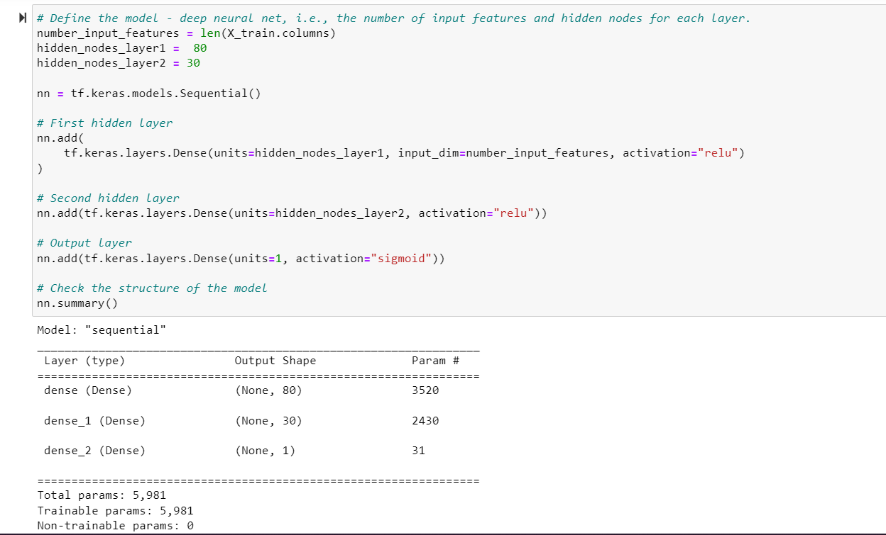
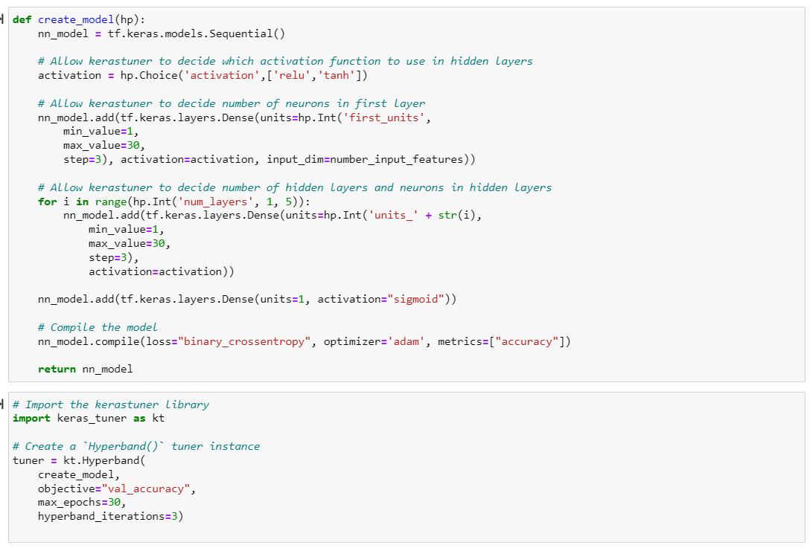

# Charity-Funding-Predictor

Using Machine Learning and Neural Networks, built a model to create a binary classifier that can predict whether applicants will be successful if funded by Alphabet Soup. 

The data set received from Alphabet Soup’s business team had more than 34,000 organizations that have received funding from Alphabet Soup over the years. Within this dataset are a number of columns that capture metadata about each organization, such as:

* **EIN** and **NAME**—Identification columns
* **APPLICATION_TYPE**—Alphabet Soup application type
* **AFFILIATION**—Affiliated sector of industry
* **CLASSIFICATION**—Government organization classification
* **USE_CASE**—Use case for funding
* **ORGANIZATION**—Organization type
* **STATUS**—Active status
* **INCOME_AMT**—Income classification
* **SPECIAL_CONSIDERATIONS**—Special consideration for application
* **ASK_AMT**—Funding amount requested
* **IS_SUCCESSFUL**—Was the money used effectively

### Step 1: Preprocess the Data

Using Pandas and scikit-learn’s `StandardScaler()`, preprocessed the dataset. 

1. Read in the charity_data.csv to a Pandas DataFrame :
  * Target Variable: IS_SUCCESSFUL
  * Feature Variables: APPLICATION_TYPE, AFFILIATION, CLASSIFICATION, USE_CASE, ORGANIZATION, STATUS, INCOME_AMT,
    SPECIAL_CONSIDERATIONS, ASK_AMT
  * Identification Variables (that were removed): EIN, NAME

2. Dropped the `EIN` and `NAME` columns.

3. Determined the number of unique values for each column.

4. Used the number of data points for each unique value to pick a cutoff point to bin "rare" categorical variables together in a new value, `Other`, and then checked if the binning was successful.

5. Used `pd.get_dummies()` to encode categorical variables.

### Step 2: Compile, Train, and Evaluate the Model

Using TensorFlow, designed a neural network, or deep learning model, to create a binary classification model that can predict if an Alphabet Soup–funded organization will be successful based on the features in the dataset. Splitted the data into the target and features, split further into training and testing sets, and scaled the training and testing data using sklearn.preprocessing.StandardScaler.

Created a callback that saves the model's weights every five epochs.

Evaluated the model using the test data to determine the loss and accuracy.

Saved and exported the results to an HDF5 file - `AlphabetSoupCharity.h5`.

### Step 3: Optimize the Model

Using TensorFlow, optimized the model to achieve a target predictive accuracy `higher than 75%`.

Preprocessed the data and did not drop the EIN & NAME columns. Model's accuracy reached 80%.

Tried few more neural models with having just dropped `EIN` column alone and had variations in the neurons and hidden layers. But reached only 73% accuracy.

**Summary**: After trying 5 different neural models, my conclusion would be that more the number of features and large dataset help train the neural model better and also provides a better accuracy in predicting the outcome.

- - -